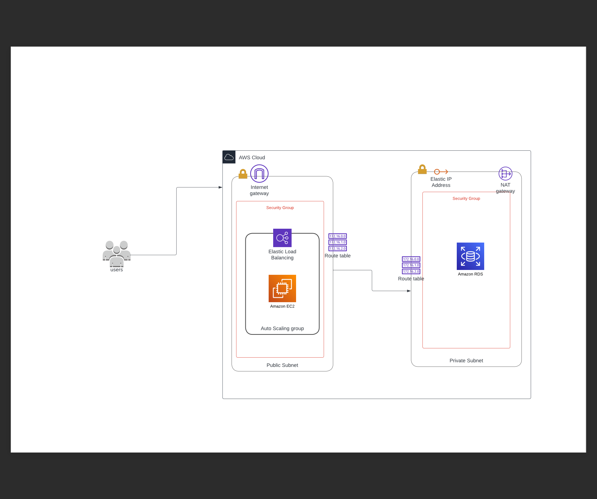

P.S I did not include the ARN for the secret manage instead I used a place holder for it the placeholder can easily be replaces with the ARN of secrets from your AWS secret manager and it would run succesfully.

I used the secret manager to add an extra layer of security to the secret.

# AWS Environment Setup using Terraform

There are many approaches one could take to comlete this task. 

I choose a security first appraoch and tried to keep the environment as simple and straight forward as possible

I also avoided over achitecting the environment

I also looked at technical debt of the team and picked an approach that is easily undersyandable 

This repository contains Terraform scripts to set up an AWS environment with an auto-scaling EC2 setup behind a load balancer and an RDS instance.

## Architecture



This scripr provisions the following resources:

- VPC
- 2 Subnet (1 private, 1 public)
- 2 route tables
- 2 security groups
- One nat gateway
- One elastic ip for the nat gateway
- RDS Instance
- Internet Gateway
- Auto Scaling Group
- Route Table
- Security Groups
- EC2 Launch Configuration

## Prerequisites

- Terraform: Ensure you have Terraform installed on your machine. You can download it from the official Terraform website: https://www.terraform.io/downloads.html

 - AWS secret manager to house the secret credentials for db_username and db_password

## Instructions
The terraform script has a main.tf file which contains the script to configure the load balancer and ec2 eith auto-scalinng. 

I put the db in a private subnet that uses a nat gateway to the db access to the internet but reject all incoming traffic excpt traffic from our public subnet 


I converted the netwotk part of the script to be a module. To help paln for scalability and high availability in the future when more ec2 would have to be deployed in multiple regions so the vpc can be easily referenced abd the infrastructure can share the same security groups and not have to reinvent the wheels 

I added an ouput.tf file to help view values of resources we are creating and easilt reference those values 

I am using AWS secret manager to store sensitve credentials and terraform is made aware of this values in the data.tf file because terraform is not handling the secret manager it is an AWS resource.

I versioned the versions of providers used because I plan on using a CICD pipeline to implement the deployment of resources which would be triggered from a repo and having a version on providers helps prevent breaking changes in the future 


1. Clone the repository:

```shell
git clone https://github.com/Obifrankie/cloudgen
cd cloudgen
